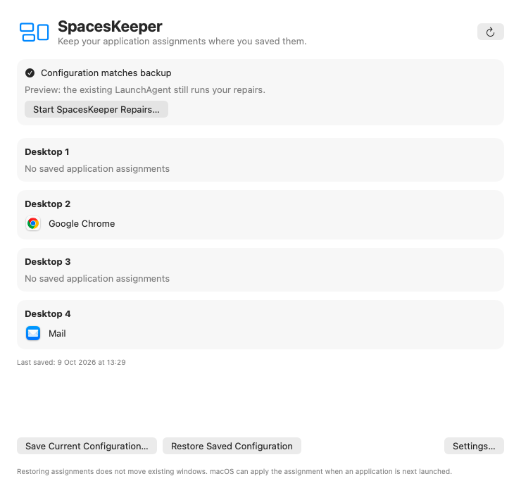

# SpacesKeeper

**Keep your Mac’s application-to-Desktop assignments—and recover broken Mission Control shortcuts after wake.**

SpacesKeeper is a small, local macOS utility built to work around two Spaces problems observed on macOS 27: disappearing application assignments after display reconnection, and Desktop-switching shortcuts that stop working after sleep or display changes.

Save the layout you want, choose the repairs you need, and let one background helper handle them after your desktop settles. A native SwiftUI interface provides configuration, settings, diagnostics and a menu-bar menu.

**A temporary workaround, with an easy way out.** There is an optional monthly reminder to check whether you still need it. Remove SpacesKeeper once macOS handles your setup reliably again.

[Install](#install-the-native-app) · [How it works](#how-it-works) · [Uninstall](#uninstall) · [Troubleshooting](#troubleshooting) · [Contributing](#contributing)



*Illustrative configuration rendered by the native interface using example data.*

## Project status

**Early development build.** Assignment repair has passed a real Thunderbolt reconnect test on macOS 27.0.1: one lost binding was restored and both saved assignments were verified, including after the coordinated Dock restart. The native app has been built, visually checked and opened in preview mode alongside the existing agent.

Native takeover, rollback, login approval, reboot and uninstall still need end-to-end validation before a public release. Universal binaries build, but Intel execution has not been verified. Local builds are ad-hoc signed, **not Developer ID signed or notarized**.

This project is independent of Apple. The observations below describe the development setup; they do not establish which Macs or macOS releases are affected, or whether a later update fixes either issue.

## The problems it addresses

| Symptom | Optional repair |
| --- | --- |
| After reconnecting a display, an app loses its Dock → Options → Assign To → Desktop assignment. | Restore missing or changed assignments from an explicitly saved backup. |
| After wake, Control–1 works but Control–2 and higher fail. Similar failures occur after display mode or mirroring changes. | Restart the current user’s Dock after the desktop becomes ready and the changes settle. |

Both fixes are independent. You can use either one without enabling the other, and the Dock workaround does not require a saved configuration.

The issues have been observed with a Dell U5226KW Thunderbolt display, including a BetterDisplay virtual-display/mirroring setup. Assignment loss was also reproduced with the virtual display disabled. BetterDisplay is not required, and SpacesKeeper does not modify its settings.

**Restoring an assignment does not move an app’s existing windows.** In the manual experiment, macOS honoured the restored assignment when the app was subsequently launched. Automatic window relocation is outside this project’s scope.

## Features

- **Explicit backups:** save your current assignments, including supported empty-string Desktop bindings. Automatic events never replace the backup; saving again retains one previous copy.
- **Conservative restoration:** check display identity, mirroring and Desktop order before writing. If the saved destination cannot be matched confidently, stop and report it.
- **Targeted updates:** restore individual bindings, preserve unrelated assignments and verify the result.
- **Coordinated repairs:** one helper handles wake and display events, waits for readiness and coalesces repeated notifications.
- **Native controls:** saved apps grouped by Desktop, app icons, independent repair settings, login control, menu-bar actions and copyable diagnostics.
- **Local operation:** no accounts, network service, telemetry or third-party runtime dependencies.

## Install the native app

### Requirements

- A Mac with a logged-in desktop session.
- Apple Command Line Tools or Xcode with a usable Swift toolchain.
- The current Spaces implementation has been exercised on **macOS 27.0.1, Apple Silicon**. The app compiles against macOS 13+ APIs; that is not a claim of compatibility with every intervening release.

If you need the compiler, run `xcode-select --install` and finish Apple’s installation first.

Download or clone this repository. Open Terminal in the repository folder, then run:

```sh
./install-app.sh
```

Run as your normal user, **without `sudo`**. The script compiles the source locally, installs the app at `~/Applications/SpacesKeeper.app` and opens it. No Terminal window needs to remain open afterwards.

Keep the app at that location: the supplied installer and uninstaller expect it there. To find it later, use Finder → Go → Go to Folder and enter `~/Applications`. You can also add it to the Dock.

### First run

1. Arrange your application assignments through the normal macOS Dock menu.
2. Click **Save Current Configuration…** and check the saved Desktop numbers and apps.
3. In **Settings**, enable **Automatic Spaces Restoration** if you want assignment repair. It is off by default on a fresh installation. Choose the wake, display and login/startup triggers you want.
4. Leave the independent **Dock Restart Workaround** enabled if restarting Dock fixes your shortcut problem, or turn it off if you only need assignment repair.
5. Click **Start SpacesKeeper Repairs…**. Approve the login item in System Settings if macOS requests it, then retry activation.

Fresh native installs use a five-second delay. Existing Dock-delay settings are preserved. Both delays are configurable from 1–60 seconds; when both repairs are scheduled together, the longer delay applies.

### Already using Spaces Wake Fix?

The app opens in **preview mode** while your existing LaunchAgent continues handling repairs. Reviewing the interface does not start a second event-monitoring helper. Save/Restore actions and repair switches use the shared configuration, so those actions do affect the existing setup.

When you choose **Start SpacesKeeper Repairs…**, the app checks login approval, stops and retains the old agent, starts the bundled helper and checks its startup before recording the handoff. If handoff fails, it attempts to restore the old service and reports any failure. The old installation remains available for rollback.

After successful takeover, the app owns repairs. **Quitting the app stops its helper.** In preview mode, quitting the app leaves the existing agent running.

For updates, quit SpacesKeeper and rerun the installer. An existing app bundle is retained as `SpacesKeeper.previous.app`; the installer asks you to move or remove that recovery copy before a subsequent update. See the [native app guide](docs/NativeApp.md) for migration and recovery details.

## Prefer the lightweight LaunchAgent?

The command-line installation remains available without the native interface:

```sh
./install.sh
```

It installs one per-user LaunchAgent, defaults to a four-second Dock delay and enables the monthly reminder. To use a five-second delay and disable reminders:

```sh
./install.sh --delay 5 --no-reminder
```

Assignment repair starts disabled. Arrange your assignments first, then explicitly save and enable restoration:

```sh
./spaceskeeper save
./spaceskeeper auto on
./spaceskeeper status
```

Useful controls:

```sh
./spaceskeeper auto off       # Disable automatic assignment restoration
./spaceskeeper dock off       # Independently disable automatic Dock restarts
./spaceskeeper restore        # Restore saved bindings once; does not restart Dock
./spaceskeeper logs           # Stream helper events
```

The repository can be moved or removed after installation. The CLI is also installed at `~/Library/Application Support/SpacesWakeFix/spaceskeeper`. See the [assignment-engine guide](docs/SpacesKeeper.md) for all commands and matching rules.

Use the native app’s settings after takeover. The legacy installer refuses to create a competing agent while native ownership is recorded.

## How it works

The shared Swift helper receives workspace wake notifications and Core Graphics display-reconfiguration callbacks. It does not poll power logs or run a background Swift interpreter.

For a relevant event, it:

1. Coalesces repeated notifications and waits for an active, awake console session.
2. Waits for the settling delay; assignment repair also observes whether the Spaces snapshot stops changing.
3. Validates the saved display configuration and ordered ordinary Desktops.
4. Restores only missing or incorrect saved bindings, if enabled, and verifies them.
5. Restarts the current user’s Dock, if enabled for that event, then verifies assignments again.

Assignment errors do not disable the independent Dock workaround. No saved backup means no automatic assignment writes. Login/startup can trigger assignment restoration, but does not itself request a Dock restart. Unlock or screen-only wake allows already-pending work to proceed; neither independently requests a restart.

Relevant mode, mirroring, main-display and connection changes can trigger repairs. Pure display-position and desktop-work-area changes are ignored. A quiet period is not a guarantee that all display software has finished: sufficiently spaced changes can produce separate repairs.

### When SpacesKeeper refuses to restore

The saved configuration must match the current display identities, main display, mirroring relationships and ordered Desktop UUIDs. A resolution change alone is allowed once stable. Reordering, deleting or recreating Desktops—or changing a virtual display’s identity—can require you to arrange and save a new configuration.

SpacesKeeper does not guess a replacement destination from a Desktop number. Ambiguous bindings and unsupported special assignments, such as an unrecognised “All Desktops” token, require manual review. Multiple displays are represented separately, but broad physical multi-display testing remains outstanding.

macOS does not expose a supported API for these application-to-Space assignments. The engine uses the observed `com.apple.spaces` preference structure through `defaults`, applying per-entry `-dict-add` updates. It never routinely replaces the whole dictionary or edits the backing plist directly. Concurrent changes are checked, but this is not an atomic transaction with Dock. See [preference access and concurrency](docs/SpacesKeeper.md#preference-access-and-concurrency).

## Monthly reminder

Enabled by default, the reminder first becomes due on the **first day of the month after installation**. If your Mac is asleep or locked, it catches up at the next available session. A local dialog asks you to check whether the workaround is still needed. **OK** acknowledges the month; **Remind me later** defers for at least an hour. Missed months do not build up a backlog.

For the LaunchAgent installation, use `./install.sh --no-reminder` to disable it; include `--delay` if you want to preserve a non-default Dock delay.

The native app currently has no reminder toggle. Quit it, edit `~/Library/Application Support/SpacesWakeFix/settings.json`, set `"reminder": false` without changing `"delay"`, then reopen it. While still in preview mode, the LaunchAgent owns this setting; use the LaunchAgent installer instead. Set the value back to `true` to re-enable reminders.

Unlock detection is best effort. It uses console/screen state and an undocumented lock-state dictionary key, which may change in a future macOS version. A reminder could appear behind the lock screen or a restart could occur too early if that information is unavailable. The reminder never removes anything automatically.

## Uninstall

For the native app, use **Settings → Uninstall SpacesKeeper…**, or run:

```sh
"$HOME/Applications/SpacesKeeper.app/Contents/Resources/uninstall-app.sh"
```

From the repository, the equivalent is `./uninstall-app.sh`.

For a LaunchAgent-only installation:

```sh
"$HOME/Library/Application Support/SpacesWakeFix/uninstall.sh"
```

Removal stops the installed repair processes, unregisters the applicable login item/agent and deletes the project’s support data, **including saved assignment backups**. Native removal also deletes the installed app. Copy a backup elsewhere first if you want to keep it.

Your actual macOS application assignments are left intact. Source files, previous app bundles retained for recovery, and macOS-managed caches/logs remain. If shutdown or removal reports an error, resolve it and retry rather than assuming uninstall completed.

To return from native ownership to the old agent without deleting your backups, use **Settings → Return to Previous LaunchAgent…**. This requires the retained legacy installation; it is not available as a replacement for an agent you never installed.

## Files installed

Everything is stored under the installing user’s home directory.

| Location | Contents |
| --- | --- |
| `~/Applications/SpacesKeeper.app` | Native app, bundled helper and removal script |
| `~/Library/Application Support/SpacesKeeper/` | Explicit assignment backup, previous backup, repair settings, diagnostics, locks and native ownership/UI state; retained legacy plist after migration |
| `~/Library/Application Support/SpacesWakeFix/` | Dock-delay/reminder settings and acknowledgement state; legacy installs also contain the helper, CLI, removal and rollback scripts |
| `~/Library/LaunchAgents/org.spaceswakefix.agent.plist` | LaunchAgent installation only; parked during native takeover |
| `~/Applications/SpacesKeeper.previous.app` | Recovery copy retained when updating an existing native app |

`org.spaceskeeper.app` and `org.spaceswakefix.agent` are project identifiers, not claims of domain ownership. The support directories are reserved for this project and removed in full on uninstall.

## Troubleshooting

### Shortcuts still fail

Check that the Desktop shortcuts are enabled in macOS and that restarting Dock manually actually fixes your symptom. If it does, inspect the logs and try a longer Dock delay in Settings. Dock can briefly disappear and Spaces animations can reset during a restart. A successful command exit means Dock was signalled; it does not prove the shortcut bug is fixed.

### Assignments were not restored

Check that you saved the intended configuration, enabled automatic restoration and enabled the relevant trigger. Open **Spaces Configuration** or **View Logs…** to see whether bindings are missing or the Desktop layout has changed. If the topology no longer matches, review the layout and explicitly save again only when it is correct. Existing windows will not move as a result of restoration.

### Watch the helper in Console

Open **Console.app**, start streaming and filter by subsystem `org.spaceswakefix.agent`. Both install modes use that subsystem. From Terminal:

```sh
log stream --style compact --predicate 'subsystem == "org.spaceswakefix.agent"'
```

For recent history:

```sh
log show --last 1h --style compact --predicate 'subsystem == "org.spaceswakefix.agent"'
```

Look for the trigger, desktop-readiness delay, restoration result and Dock exit status. Log availability and retention are controlled by macOS. The native diagnostics window also includes a **Copy Diagnostics** button.

### App or helper is not running

Reopen `~/Applications/SpacesKeeper.app`. After native takeover, check **Launch at Login** and any approval request under System Settings → General → Login Items. Hiding the menu-bar icon makes the app appear in the Dock so you can still access it.

For a LaunchAgent installation or native preview, inspect the old service with:

```sh
launchctl print "gui/$(id -u)/org.spaceswakefix.agent"
```

That label is expected to be absent after native takeover. Do not reinstall the old agent to diagnose a native-owned setup; use the app’s recovery controls.

### Build fails

Check that Apple’s selected toolchain is installed and usable. If Xcode is awaiting its licence but separately installed Command Line Tools work, select them for this command only:

```sh
DEVELOPER_DIR=/Library/Developer/CommandLineTools ./install-app.sh
```

The installers do not accept Apple licences or change the system’s Xcode selection. Unsigned/notarization-related download warnings are not addressed by disabling Gatekeeper; this development version is intended to be reviewed and built locally.

## Privacy and permissions

No network calls, analytics, accounts or external services. Normal operation does not require administrator privileges, Accessibility, Full Disk Access or screen recording. Native login registration and optional failure notifications use macOS permission controls.

The helper reads display/Spaces configuration and session readiness, writes targeted application assignments and signals only your user’s Dock. It does not capture keystrokes, screen content or application documents. Saved configuration and diagnostics stay local. Diagnostics can reveal application names, bundle identifiers, display identifiers and Space UUIDs; review them before posting an issue. Logs contain local lifecycle, repair and error information.

## Development

There are no third-party runtime dependencies. The main pieces are:

| File | Responsibility |
| --- | --- |
| [`Sources/Assignments.swift`](Sources/Assignments.swift) | Backup format, matching, targeted restoration, verification and CLI |
| [`Sources/main.swift`](Sources/main.swift) | Wake/display scheduling, Dock restart, reminder and logging |
| [`Native/SpacesKeeperApp.swift`](Native/SpacesKeeperApp.swift) | Native interface, login item and helper lifecycle |
| [`tests/AssignmentTests.swift`](tests/AssignmentTests.swift) | Restoration and isolated preferences integration tests |

Run the checks or build without installing:

```sh
./tests/check.sh
./build-app.sh
```

The checks cover scheduling, reminder timing, display-event filtering, targeted restoration, empty bindings, topology refusal, concurrency, verification, backup persistence and independent feature switches. Integration tests use a disposable preferences domain. They do not delete your real Chrome assignment, install an agent or restart Dock.

To build both Apple Silicon and Intel slices and package the app:

```sh
./package-release.sh
```

The archive is written under `.build/`. Intel execution remains untested; the development toolchain emitted Intel compatibility-library linker warnings. Developer ID signing, notarization and physical lifecycle tests are still needed for a normal public binary release. See the [native build and release guide](docs/NativeApp.md#release-packaging).

## Contributing

Focused bug reports, reproducible tests and small fixes are welcome. Please include:

- macOS version/build and Mac architecture.
- Display arrangement, mirroring/virtual-display use, and whether it changed.
- App or LaunchAgent installation, enabled repairs and configured delays.
- The trigger: sleep/wake, unlock, display reconnection or mode change.
- Expected and observed behavior, with a short, reviewed diagnostic/log excerpt.

Mention whether manually restarting Dock helps and whether the saved Desktop layout still matches. Avoid attaching your entire preferences directory or unreviewed diagnostic dumps.

Useful validation includes long sleep/unlock, display-only reconnection, physical multi-display layouts, native migration/rollback, reboot, notification denial and clean removal. A passing unit test cannot establish behavior across all those conditions.

Keep repairs conservative: no automatic backup replacement, guessed Desktop destinations, whole-domain preference rewrites or window relocation. Preserve independent control of the two fixes.

## License

[MIT](LICENSE). Use, inspect, modify and share it. When you no longer need the workaround, [uninstall it](#uninstall).
